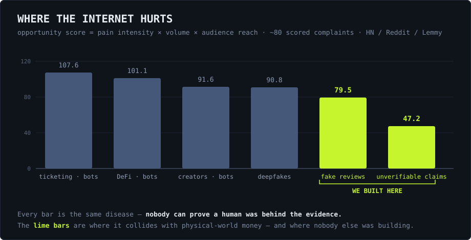
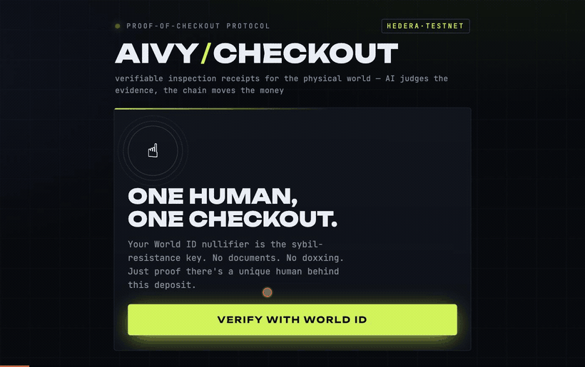
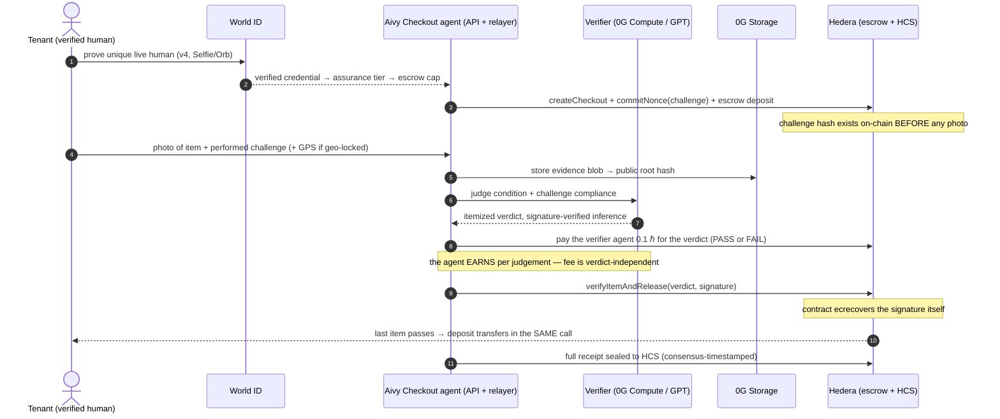
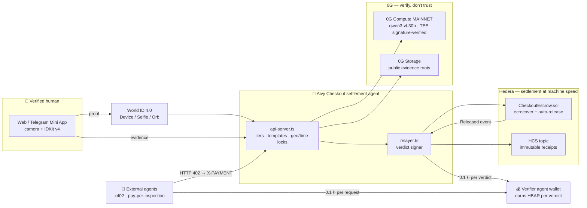
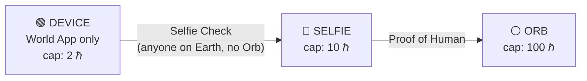

# Aivy Checkout

<p align="center">
  <a href="https://checkout.aivylabs.xyz"></a>
  
  <a href="https://hashscan.io/testnet/contract/0x83B55906c6359c3f43Bf95cb8Cdef4455DB68226"></a>
  
  
  
</p>

**Verifiable inspection receipts for the physical world — an AI judges the evidence, the chain moves the money, and a human is provably behind every photo.**

AI can analyze evidence perfectly, but it cannot walk to the apartment. Every deposit
dispute on Earth is two people, two photos, zero proof. Aivy Checkout closes that gap: a
**verified unique human** captures evidence against a **liveness challenge committed
on-chain before the photo exists**, a **verifiable AI** signs an itemized verdict, and
an **escrow releases the money the instant the last item passes** — no counterparty in
the loop, and a receipt anyone can audit forever.

Built solo at **ETHGlobal Lisboa** · Hedera × World × 0G

> **Provenance, to be precise:** *Aivy* is our agent brand — the original
> **Aivy** ("deploy AI agents on Hedera in 60 seconds") took **3rd place at
> Hedera's APEX hackathon**. **Aivy Checkout is a new product built entirely
> during the Lisboa window** — first commit to final feature, the history in
> this repo is the build log. The only prior asset it touches is
> [OculusVault](https://github.com/jmgomezl/oculusvaultwallet), our Hedera
> wallet Mini App, integrated by address for payouts.

---

## 🔍 Why this exists — mined, not brainstormed

This product started as a **data pipeline, not an idea**. Before writing a line of
product code we built [a pain-mining tool](docs/research/) that harvested and scored
complaints across Hacker News, Reddit and Lemmy — ~80 scored documents ranked by
`pain intensity × volume × audience reach` — hunting for the places where the world
most lacks *verified humans producing verifiable evidence*. The reports are in
[docs/research/](docs/research/), generated the first night, receipts linked.

<table align="center">
  <tr>
    <td align="center"><b>~80</b><br/><sub>complaints scored</sub></td>
    <td align="center"><b>3</b><br/><sub>platforms mined<br/>HN · Reddit · Lemmy</sub></td>
    <td align="center"><b>10,639</b><br/><sub>reach of the top<br/>fake-review thread</sub></td>
    <td align="center"><b>+23%</b><br/><sub>insurance premium hike<br/>blamed on AI fraud</sub></td>
    <td align="center"><b>107.6</b><br/><sub>highest opportunity<br/>score (bots vs humans)</sub></td>
  </tr>
</table>



What the data kept saying:

- **[“My insurance rates went up 23% — AI fraud is wilder than I thought”](https://www.reddit.com/r/Insurance/comments/1uamntf/my_insurance_rates_went_up_again_went_down_a/)** (r/Insurance) — generative AI has made photo evidence forgeable at zero cost, and everyone's premiums are paying for it
- **[“Farmers denied my claim — neighbor's illegal contractor damaged my house”](https://www.reddit.com/r/Insurance/comments/1h99r16/farmers_denied_claim_neighbors_illegal_contractor/)** (r/Insurance) — real physical-world damage, no verifiable trail of who did what, claim dead
- **[“What's the best site to buy Google reviews?”](https://www.reddit.com/r/smallbusiness/comments/1okn7vb/whats_the_best_site_to_buy_google_reviews/)** (r/smallbusiness, 10k+ reach) — trust signals are simply for sale
- The HN sweep ranked **bot flooding, deepfakes and verification friction** as the top pain across ticketing, DeFi and creator platforms — 61 documents, one theme

The common failure isn't detection — it's that **evidence is judged after the fact,
when it's already forgeable**. So we built the inverse: a challenge **committed
on-chain before the photo exists**, captured by a **provably unique human**, judged
by **verifiable inference**, settling **money on proof**. Every deposit dispute on
Earth is two people, two photos, zero proof — that's the wedge; the engine
generalizes to every checklist in the physical world.

---



<sub>Recorded against the live site. **One human, one checkout** — World ID gates entry.
Pick an inspection or design your own. Before the deposit locks you choose the terms:
**geo-lock** (proves *where*), **time lock** (proves *when*), and who judges the evidence
— **0G TEE · verifiable** or a frontier model. At the bottom: every finished case,
replayed from the Hedera Consensus Service topic rather than read from a database.
The capture → verdict → payout leg is step 3–5 below; it needs a physical object in
someone's hand, so it is filmed in the demo video rather than automated here.</sub>

---

## ⏱ The 90-second judge tour

1. Open **https://checkout.aivylabs.xyz** → verify with World ID (real, v4)
2. Pick **Rental Checkout** → your 2 ℏ deposit escrows on Hedera testnet in front of you
3. Follow a liveness challenge (*"place the yellow plush toy on the chair"*) → shoot → watch: `hash → 0G Storage → AI verdict → signed → ecrecover on-chain`
4. Pass every item → **the deposit pays out in the same transaction** → a paper receipt prints with clickable HashScan links, the 0G storage root, and the verified-inference line
5. Try to cheat (wrong object, reused photo) → signed **FAIL** verdict lands on-chain → **funds stay locked**

| Live | |
|---|---|
| Web app | **https://checkout.aivylabs.xyz** |
| Telegram Mini App | **https://t.me/aivycheckout_bot** |
| Escrow (Hedera testnet) | [`0x83B5…8226`](https://hashscan.io/testnet/contract/0x83B55906c6359c3f43Bf95cb8Cdef4455DB68226) |
| Receipt log (HCS) | [topic `0.0.9736741`](https://hashscan.io/testnet/topic/0.0.9736741) |
| World ID | `app_952df7edf32b602c03c445e6732ea04a` · action `aivy-checkout` · World ID 4.0 live |

Everything above is live infrastructure — no mocks in the money path.

---

## The loop, end to end



**Why a stored or AI-generated image can never win:** it would have to satisfy a
challenge that did not exist until the checkout opened — the challenge hash is
committed on-chain first, and the verdict is only accepted if it matches.

---

## Architecture



One engine, six inspection templates (rental, vehicle, scooter, delivery, expense
receipt, shelf audit) plus a **build-your-own** designer — because the contract never
knew it was about apartments.

---

# Sponsor integrations — why each one, precisely

## ⛓ Hedera — the autonomous escrow that settles at machine speed

**What Aivy Checkout is, in Hedera's terms: an AI agent that moves value autonomously.**
It opens escrows, commits challenge hashes, accepts signed AI verdicts, releases
HBAR the moment conditions verify, and seals every receipt — *hold funds, verify
delivery via HCS-anchored evidence, auto-release on condition match*. The agentic
economy needs settlement that works at machine speed; a deposit release that costs
sub-cent and finalizes in seconds is the only reason "the AI approved it → you're
already paid" works as a product.

| Hedera piece | How we use it | Proof |
|---|---|---|
| EVM smart contract (Solidity, Foundry) | `CheckoutEscrow` — itemized state machine, `ecrecover`-verified verdicts, unilateral auto-release, timeout resolution, registrar-gated creation | [contract](https://hashscan.io/testnet/contract/0x83B55906c6359c3f43Bf95cb8Cdef4455DB68226) · 22 forge tests |
| **Native HBAR** value transfer | The deposit itself — no token overhead where none is needed | every `Released` tx |
| **HCS** (Consensus Service) | A **full lifecycle audit trail**, not just a terminal receipt: `checkout_created → nonces_committed → verdict_signed (per item) → escrow_released`, each consensus-timestamped and publicly ordered — watch the topic fill in real time during a checkout | [topic `0.0.9736741`](https://hashscan.io/testnet/topic/0.0.9736741) |
| JS SDK (`@hashgraph/sdk`) | HCS topic creation + receipt sealing from the agent | `offchain/relayer.ts`, `api-server.ts` |
| **Agent economy** — native HBAR fees | The verifier agent is an **economically separate actor**: the platform pays it **0.1 ℏ per verdict** into [its own wallet](https://hashscan.io/testnet/account/0x732Daf3D26A3a1F7f9978d006A5F099b0Fa00f5E), and external agents pay the same wallet via x402 — every fee is a Hashscan-visible transaction, linked on the receipt | `agent fee` line on every receipt |

**Privacy by construction on the public record:** item descriptions travel to HCS
as keccak hashes (provably fixed at creation, never revealed — reveal the text later
and anyone can verify it matched), and geo-lock coordinates are rounded to ~1 km
before sealing — the receipt proves the *area and the order of events*, not your
doorstep. Private metadata, public consensus.

**The autonomous part is structural, not cosmetic:** `verifyItemAndRelease` checks the
verdict signature *and transfers in the same call*. There is no "host approves payout"
step anywhere in the system — the human who owes the money cannot withhold it once the
condition proves. That is what agentic payments should mean.

**The AI is a paid worker, not a free subroutine — value flows BOTH directions:**

1. **The agent's judgement moves escrowed money** — a signed verdict releases the
   deposit autonomously (the hard direction: AI judgement as the load-bearing
   condition for value transfer).
2. **Money moves TO the agent for judging** — every inspection pays the verifier
   agent **0.1 ℏ in native HBAR** into its own wallet
   ([`0x732D…0f5E`](https://hashscan.io/testnet/account/0x732Daf3D26A3a1F7f9978d006A5F099b0Fa00f5E)),
   internally per verdict and externally per x402 request. The fee is paid
   **PASS or FAIL** — the agent earns for judging, never for approving, so its
   income cannot bias its verdicts.

The economics this unlocks: an AI verifier with **its own balance sheet** — revenue
per judgement today; paying for its own 0G inference out of earnings tomorrow. A
sub-cent, seconds-final fee rail is what makes a 0.1 ℏ per-verdict wage viable at
all — this business cannot exist on a chain where the fee costs more than the work.

**Novel vs. prior art:** escrows are old; escrows whose release condition is a
*cryptographically verified AI judgement of physical reality* — with the anti-replay
challenge living in the contract, not in a prompt — are not.

### x402 extension — the verifier as a paid agent-to-agent service

The escrow is the main act: value moves *autonomously* on verified conditions. The
x402 endpoint is the same engine faced outward: **an external agent pays HBAR per
request** to buy one signed inspection verdict from Aivy's verifier.

`POST /api/x402/inspect` speaks the x402 flow — no `X-PAYMENT` header returns an
**HTTP 402 challenge** with x402-shaped `accepts[]`; the agent then makes a real
HBAR transfer on Hedera testnet and retries with the transaction id, which we
verify against the **public mirror node** (recipient, amount ≥ price, ≤10 min old,
one inspection per tx) before running the verdict and signing the response with
the same key the escrow contract trusts. External x402 revenue lands in the **same
agent wallet** that earns the internal per-verdict fees — one worker, one balance
sheet, two customer types.

```bash
# see the 402 challenge (also demoable live from the app's footer panel)
curl -si -X POST https://checkout.aivylabs.xyz/api/x402/inspect | head -30
```

Setup: `X402_ENABLED=1` (optional `X402_PAY_TO`, `X402_PRICE_TINYBAR`, default 0.1 ℏ).

**Honest limitations:** x402 has no Hedera facilitator yet, so the scheme
(`hedera-hbar-transfer`) is custom — protocol-shaped, really settled, but not
interoperable with EVM x402 clients that expect EIP-3009 tokens; the replay guard
is in-memory (per boot). Settlement is never assumed: every "paid" in a response
was verified on the mirror node first.

**Honest gaps:** relayer key = authorized signer (single trusted signer; the contract
supports hot-swapping to a TEE key — tested); nonces are committed at checkout open
rather than per-capture-session; API state is in-memory. Engineering scars we kept for
the next team: Hedera's EVM denominates `msg.value` in **tinybar** while the JSON-RPC
relay speaks 18-decimal weibar, the relay rejects future nonces instead of queueing,
and payouts to accounts that don't exist yet revert (we pre-check the mirror node so a
typo can't trap a deposit).

## 🌐 World — the human layer: who is behind the camera, and how sure are we

**Aivy Checkout is a product for verified humans in an AI-assisted interaction** — the exact
thing World's stack exists for. The evidence layer is only as good as the claim that a
*real, live person* is behind the screen — so we made assurance level do real work:



**Verification level sets economic terms, not login.** Try to open a 10 ℏ vehicle
escrow on a device-tier account and the platform **blocks, explains, and steps you
up** — Selfie Check or Orb, in-app, live. That is Selfie Check used as a risk and
eligibility signal in the most literal sense: the credential level is the collateral
ceiling.

| World piece | How we use it | Where |
|---|---|---|
| **World ID 4.0** (IDKit 4.2.1) | Backend-signed `rp_context` (`signRequest`), `IDKitRequestWidget`, verification via `POST /api/v4/verify/{rp_id}` | `webapp/src/App.tsx`, `offchain/api-server.ts` |
| **Selfie Check (beta)** | The middle assurance rung — `selfieCheckLegacy` preset, live behind the step-up gate | step-up panel |
| Proof of Human | `proofOfHuman` preset for the top tier | step-up panel |
| Nullifier | Sybil key: one human = one active checkout; wallet linked once to the nullifier (never asked twice) | tier engine |
| **Security posture** | Tier derives **only from World-verified credential identifiers** — the client hint is ignored for access control | `/api/world/verify-v4` |
| **Beta testing documentation** | Dev + user feedback, including real integration findings (portal action API, v2/v4 fork, rp_context DX) | [docs/WORLD_INTEGRATION_FEEDBACK.md](docs/WORLD_INTEGRATION_FEEDBACK.md) |

**Why Selfie Check matters here specifically:** it is the tier that makes the platform
usable by *anyone on Earth* — no Orb within a thousand kilometers, still a real,
economically-bounded account. Privacy holds the product promise: the app never sees
biometrics or documents — only the anonymous nullifier and the credential *level*.

**Honest gaps:** the exact credential identifier strings in the live v4 verify
response are parsed defensively (fails toward the lowest tier) until the first real
Selfie proof pins them; `session_id`-based continuity is roadmap — the nullifier
carries identity for now.

## 🧠 0G — verified, not blindly trusted

**The verdict that moves the money should not be a trusted API call.** That is 0G's
entire thesis — *every action cryptographically verified and settled on-chain instead
of blindly trusted* — and Aivy Checkout applies it to the exact judgement where trust is
weakest: an AI deciding whether your photo releases someone's deposit.

| 0G piece | How we use it | Proof |
|---|---|---|
| **0G Compute (MAINNET)** | The verdict brain: `qwen/qwen3-vl-30b-a3b-instruct` (TeeML) via the broker SDK on **0G mainnet** — on-chain provider acknowledgement, signed request headers, **per-response signature verified** with `processResponse`; the receipt prints `0G COMPUTE · qwen3-vl-30b · TEE SIG ✓` | provider [`0x4415…0868`](https://chainscan.0g.ai/address/0x4415ef5CBb415347bb18493af7cE01f225Fc0868), funded ledger on-chain (chain 16661) |
| **0G Storage** | Every evidence blob — merkle root on the receipt, **publicly downloadable by anyone** via the indexer | `https://indexer-storage-testnet-turbo.0g.ai/file?root=…` links on every receipt |
| User choice | A **verifier selector** in the app: `0G TEE · VERIFIABLE` vs `GPT · FRONTIER` — the verifiability trade-off as a product surface | checkout setup |

**What we claim and refuse to claim, precisely** (this rigor is the feedback a beta
wants): providers register `verifiability: TeeML` and our client verifies whatever
they offer. On the **testnet** provider, response signatures verified but the
attestation endpoint returned *501: attestation not available for centralized
providers* (payload tagged `centralized:aliyun`). The **mainnet** 30B provider's
response signatures verify on every call (`processResponse → true`). The honest
claim is **signature-verified inference on 0G Compute**, not independently audited
TEE attestation. The code verifies whatever the provider offers; the day an attesting
multimodal provider is live, this becomes TEE-sealed with **zero code changes**. A
fallback verdict (provider slow/down → GPT) is never laundered as a 0G verdict — the
receipt names the brain that actually decided.

**A finding worth more than a feature (beta feedback):** verifier capability is
challenge-dependent, and we measured it on real evidence. The testnet 7B
(`qwen2.5-omni-7b`) *did not perceive* an unlit lamp at the frame edge (its
"seen" field never mentioned it) and passed a state-critical challenge —
twice. GPT on the same photo correctly failed it. So we funded a mainnet
ledger and re-ran the same two control photos against mainnet's
`qwen3-vl-30b` (TeeML): **lamp ON → approved** ("clearly glowing green as
instructed"), **lamp OFF → rejected** ("no green light is visible") — both
responses signature-verified. The 30B earns the flagship; the 7B result
stands as testnet feedback: state-critical money decisions need mainnet-class
perception, and 0G's catalog now has it.

**Engineering scars kept for the next team:** the maintained SDK is
`@0gfoundation/0g-storage-ts-sdk` — the older `@0glabs` package targets a retired flow
contract and reverts on Galileo (16602); the response signature lives under the
`zg-res-key` header, not the chat id; storage finalization is kept off the critical
path (12s budget, background completion — the on-chain keccak is identical either way).

---

## Deployments

**Hedera testnet** — where the deposit is escrowed and released.

| what | address |
|---|---|
| `CheckoutEscrow` | [`0x83B55906c6359c3f43Bf95cb8Cdef4455DB68226`](https://hashscan.io/testnet/contract/0x83B55906c6359c3f43Bf95cb8Cdef4455DB68226) |
| Relayer / authorized verdict signer | [`0x44f7769bFB6E872f491CcF0B655Bee8c06A640a0`](https://hashscan.io/testnet/account/0x44f7769bFB6E872f491CcF0B655Bee8c06A640a0) |
| HCS receipt topic | [`0.0.9736741`](https://hashscan.io/testnet/topic/0.0.9736741) |

**0G** — evidence stored on Galileo testnet (chain 16602); inference bought on **mainnet** (chain 16661), where the catalog holds a VLM strong enough to judge STATE.

| what | address |
|---|---|
| Our 0G account (funds the compute ledger and storage) | `0x44f7769bFB6E872f491CcF0B655Bee8c06A640a0` |
| **Mainnet** inference provider acknowledged on-chain (`qwen/qwen3-vl-30b-a3b-instruct`, TeeML) | [`0x4415ef5CBb415347bb18493af7cE01f225Fc0868`](https://chainscan.0g.ai/address/0x4415ef5CBb415347bb18493af7cE01f225Fc0868) |
| Testnet inference provider (`qwen2.5-omni-7b`, kept as the back-compat default) | `0xa48f01287233509FD694a22Bf840225062E67836` |

`CheckoutEscrow` is ours. The 0G ledger and serving contracts are the network's —
listed because our account holds a funded ledger there and each verdict is billed
through them.

---

## The signed payload (single source of truth)

`ItemVerdict` is mirrored byte-for-byte in `src/ItemVerdictVerifier.sol` and
`offchain/payload.ts`. Change one, change both — `npm run parity` proves they agree.

```solidity
struct ItemVerdict {
  uint256 checkoutId;
  bytes32 itemId;     // keccak256(item name)
  bool    verdict;    // true = PASS
  bytes32 imageHash;  // keccak256 of the evidence blob
  bytes32 nonceHash;  // keccak256 of the per-item liveness nonce
  uint256 deadline;   // unix; session time-box
}
```

Digest = `personal_sign(keccak256(abi.encode(fields)))`, matching ethers
`wallet.signMessage(getBytes(structHash))`. The evidence hash is inside the signed
payload; the contract checks the nonce commitment and the signature before a single
tinybar moves.

## Templates

One escrow and one verdict engine, many checklists — anything two parties dispute at a
handover.

| Template | Who pays for it |
|---|---|
| Rental Checkout *(flagship)* | hosts & property managers |
| Expense Receipt | finance teams & expense platforms |
| Vehicle Return | rental fleets & insurers |
| Scooter Return | micromobility fleets & insurers |
| Delivery Handover | merchants & 3PLs |
| Retail Shelf Audit | CPG brands & distributors |

Plus the in-app **custom builder**: define your own items, AI criteria and liveness
challenges (even *"a handwritten note reading X held next to the lamp"* — the verifier
reads handwriting). Optional per-checkout **geo-lock** (GPS sealed into every capture)
and **time-lock** (evidence window enforced by the on-chain deadline) complete the
tuple: **who · that-it's-now · where · when · what — each independently verifiable.**

Note what Expense Receipt changes: the subject stops being an object's condition and
becomes a document's authenticity — a challenge committed on-chain before the photo
exists cannot be satisfied by a screenshot that already existed. Same escrow, same
signature, different fraud.

## Tests

```bash
forge test          # 22 passed, 0 failed
```

Happy path, FAIL-keeps-funds-locked, timeout→host, replay, wrong signer, uncommitted
nonce, wrong deposit, registrar gate, relayer→TEE signer swap. `cd offchain && npm
test` runs 30 more over the guards (key resolution, personhood mode, nonce generation,
prompt sanitising).

```bash
anvil &                               # local chain
cd offchain && npm i && npm run e2e   # full loop incl. rejection + timeout paths
npm run parity                        # TS signature recovers to the same signer
npm run probe:compute                 # 0G Compute: ledger, handshake, sig verification
```

## Layout

```
aivy-checkout/
  src/CheckoutEscrow.sol          itemized escrow state machine + auto-release
  src/ItemVerdictVerifier.sol     the ecrecover verdict core
  test/                           22 forge tests
  offchain/
    api-server.ts                 HTTP API: World ID gate, tiers, checkouts, evidence
    payload.ts                    shared ItemVerdict schema + signer
    vision-agent.ts               adversarial verifier (0G Compute / GPT / offline mock)
    compute-0g.ts                 0G Compute broker: signed, verified inference
    storage-0g.ts                 0G Storage with content-addressed local fallback
    relayer.ts                    signs verdicts, submits, seals receipts to HCS
    e2e-demo.ts                   whole loop on a local Anvil chain
  webapp/                         React mini app (IDKit v4, camera, paper receipt)
  docs/                           pitch, World beta feedback, Selfie activation runbook
  scripts/deploy.sh               build, ship, restart
```

## Configuration

`RPC_URL`, `RELAYER_PRIVATE_KEY`, `ESCROW_ADDRESS`, `PORT`, `CORS_ORIGIN`,
`OPENAI_API_KEY`, `HCS_TOPIC_ID`, `HEDERA_OPERATOR_ID`/`HEDERA_OPERATOR_KEY`,
`WORLD_APP_ID`/`WORLD_ACTION`, `WORLD_RP_ID`/`WORLD_RP_SIGNING_KEY`,
`SELFIE_CHECK_ENABLED`, `ZEROG_RPC_URL`/`ZEROG_INDEXER_URL`/`ZEROG_PRIVATE_KEY`,
`ZEROG_TIMEOUT_MS`/`ZEROG_COMPUTE`.

Unset `WORLD_APP_ID` and the app runs in simulator mode; unset the 0G or vision creds
and each falls back loudly rather than silently. The contract flow is identical either
way.

## License

MIT — see [LICENSE](LICENSE).

## Team

**Juan Manuel Gomez** — Telegram [@jmgomezl](https://t.me/jmgomezl) · GitHub
[@jmgomezl](https://github.com/jmgomezl)

## Toolchain

Foundry (`forge`), Node 20+, npm. Deploy target: Hedera testnet EVM via a JSON-RPC
relay (`https://testnet.hashio.io/api`). Native HBAR escrow.
